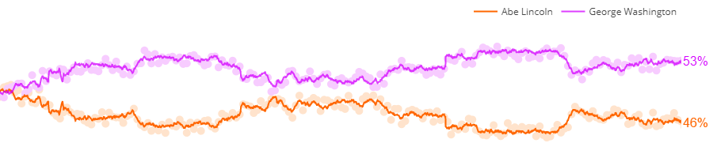
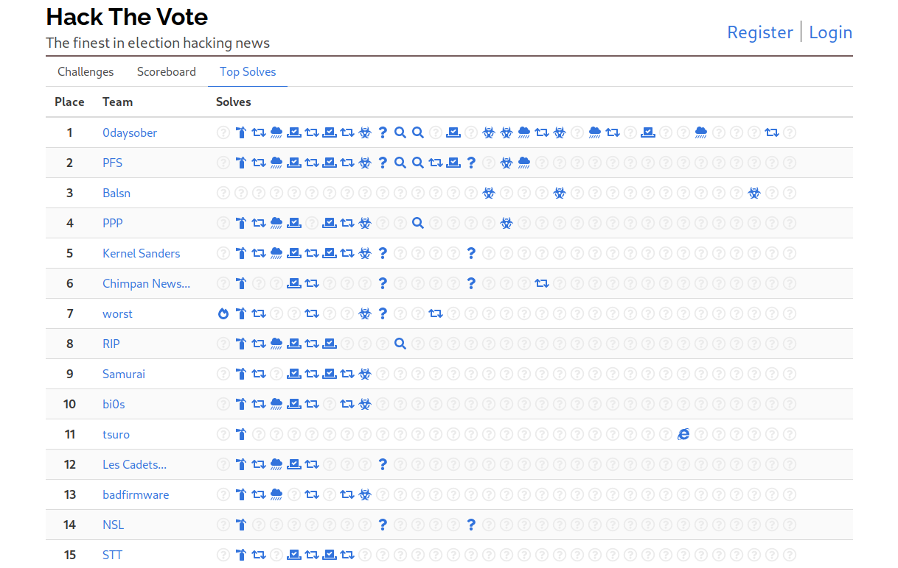
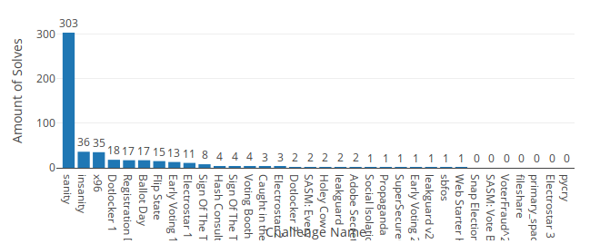

# Hack The Vote 2020

Hack The Vote 2020 was run by [RPISEC](https://rpis.ec) from October 23rd to 25th, 2020 (2020-10-23T23:00Z/2020-10-25T23:00Z).

## Theme

This year we simulated a presidential election between Cyber George Washington and Cyber Abraham Lincoln. After every solve, teams redirected hacked votes to one of the candidates. George Washington took an early lead and carried it through the end of the competition, becoming the 2020 Cyber President.

## Statistics

|  |  |
| --- | --- |
| Teams registered | 676 |
| Teams scored: | 311 |
| Sanity solves | 339 |
| Insanity solves | 36 |
| Correct flags | 508|
| Incorrect flags | 145 |
| Points available | 9783 |
| 1st place points | 5518 |
| Number of challs | 34 |
| 1st place challs solved | 22 |

Unsolved challenges:

- pycry
- Electrostar 3
- primary_space_saver
- fileshare
- VoterFraud^2
- SASM: Vote By Post
- Snap Election

## Organizers

Perri Adams, Stefan Blair, Amy Burnett, Jared Candelaria, Jack Dates, Andrew Fasano, Josh Ferrell, Markus Gaasedelen, Michael Krasnitski, Mike Macelletti, Toshi Piazza, Austin Ralls, Max Shavrick, Glenn Smith, Avi Weinstock, and Wilson Wong
